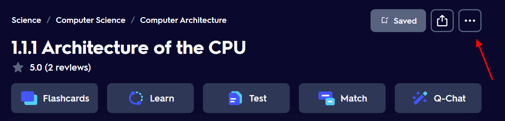
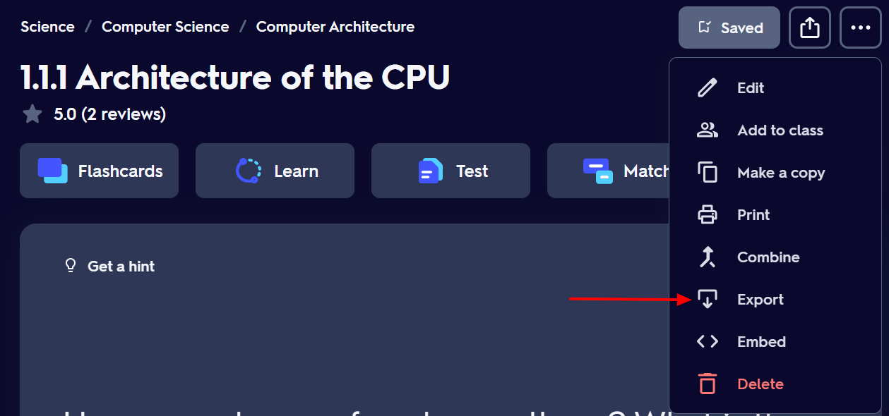
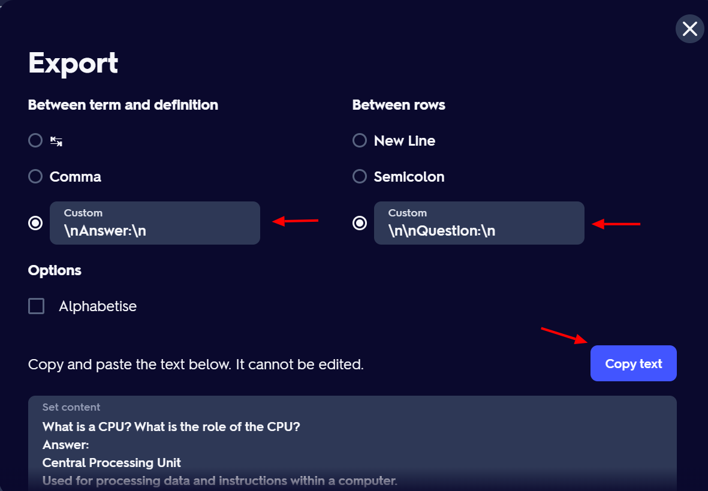

# RubberDuck
A helpful flashcard study tool that tests you on your flashcards, guiding you towards correcting your answers instead of giving them away, and helping you build a more long-term understanding of the material.

## How to use this app
1. Import or create a deck (see FAQs for more information on how to do this).
2. The question appears on the flashcard side. In the text box, give the questions a go.
3. If you got it right, rubberduck will let you know, show you the answer side, and you can move on to the next question
4. If you didn't, rubberduck will give you a helpful hint towards answering the question, and you can have another go.

## Why this app
It is well documented that being tested on material, and active recall, is the best way to learn.
Flashcards have long been a staple of mine and many other students revision. The best way to use flashcards is to be tested on them by someone else - then when you don't quite get the answer, instead of just looking at the back and going "ohhh yeah I knew that", the person testing you would instead ask probing questions to reveal the knowledge you had all along - "ooh you missed a bit about the purpose of XYZ". However, I like studying alone, since as soon as my friends come in to the equation I get distracted - 10 minutes into a flashcards session we'll be yapping about something or another. So to simulate the same process of working towards the correct answer, I built this app. This will test you in the same way, revealing helpful hints to help you towards the right answer, leading to better long-term retention of the knowledge.

I also just wanted to mess around with the AI APIs and prompt engineering and all that hyped up stuff, and I love design and front-end so I enjoy making full-stack applications 😊

## FAQs
### How do I create a new deck?
Press the '+ New Deck' button and start filling it out. Fill in the name of the deck.
Once you're ready, press the save button. This will also download a txt file version of the flashcards.
We recommend that you save this in a dedicated folder for your flashcards - you can later import from this txt file if you ever want to revisit a deck.

### How do I open a previous deck?
If you have saved the txt file tha was generated from when you created the deck, simply press the '+ New Deck' button, then the 'Import from txt file button', navigate to you txt file and select it. If you did not save the txt, there is no other way currently to load previous decks - its on the roadmap for future development though!

### How do I import my Quizlet decks?
You need to export the Quizlet cards in a specific format as follows:
Navigate to your Quizlet deck and click the export button:

Then export in the format shown below:

And then use the Copy text button to copy the data. Paste it into a text file, and then you can import the flashcards from this text file into rubberduck.

## Roadmap
- Add proper landing material (currently just loads an empty deck which will cause weird behaviour if you try to interact with it)
  - Preferably on screen prompts to guide you towards making/importing a deck to get started
- Improve front-end adaptability (i.e. make available as mobile app, and more reactive to resizing)
- Convert to desktop app
- Add ability to save flashcard decks to a specific folder, and reopen previous decks easily
  - For example, in my mockups, I had a dropdown showing the decks you've created so far allowing you to reopen them (instead of re-importing from the New Deck modal)
  
- Add ability to change number of hints (currently set to 1)
- Add ability to select whether deck is shuffled or in-order
- Add theming - dark mode, high-contrast
- Add text-to-speech to read out hints/prompts?

